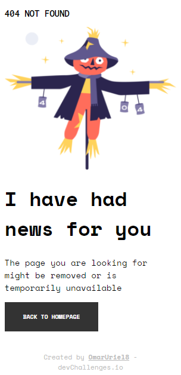
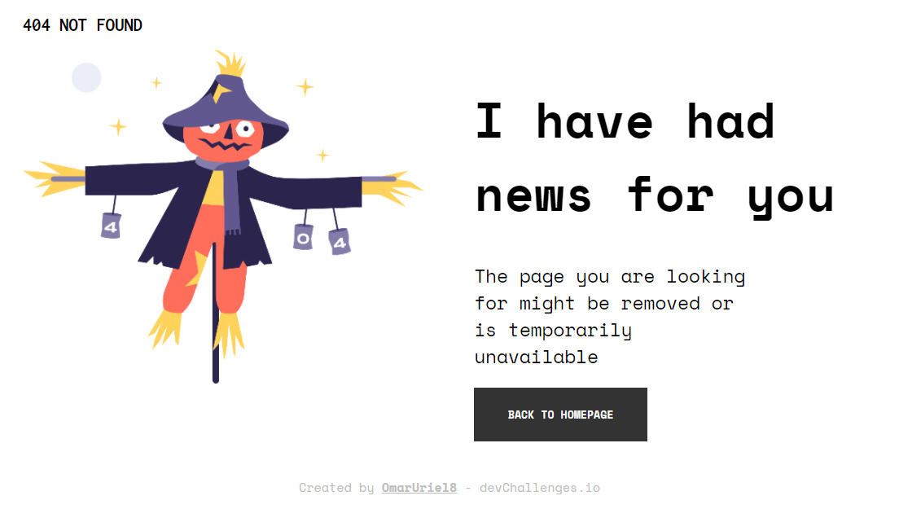

# 404 Not Found

---

## Tabla de contenido
---

- [Vista general](#vista-general)
- [Sobre el proyecto](#sobre-el-proyecto)
- [Recursos](#recursos)
- [Construido con](#construido-con)
- [Comó usarlo](#como-usarlo)

## Vista General

---

Diseño de pagina de error 404 para Smartphone



Diseño de pagina de error 404 para Escritorio



## Sobre el proyecto

---

Diseño Responsive de la pagina del error 404

## Recursos

---

Este diseño fue construida en base al reto 404 Not Found del sitio [DevChallenge](https://devchallenges.io/challenges/wBunSb7FPrIepJZAg0sY).

## Construido con

---

- Vite
- React
- CSS Responsive design

## Como usarlo

---

Comandos para la terminal

```bash
# Instalar dependencias
$ npm install

# Correr la app
$ npm run dev
```
